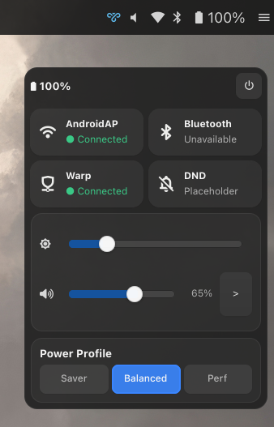

# Quick Settings (qs)

Quick Settings (qs) is a modern, lightweight quick settings panel and top bar for Wayland compositors (tested with [niri](https://github.com/YaLTeR/niri)).

**This project is in active development and needs more real-world testing.**
Contributions, bug reports, and feedback are welcome!

**A sample Waybar config is also included in this repository for easy integration.**

## Screenshot




## Services and Integration

| Component         | Method   | Backend/Tool                                    |
|-------------------|----------|------------------------------------------------|
| WiFi              | D-Bus    | NetworkManager (org.freedesktop.NetworkManager) |
| Bluetooth         | D-Bus    | BlueZ (org.bluez)                               |
| Audio/Volume      | CLI      | wpctl (WirePlumber)                             |
| Brightness        | CLI      | brightnessctl                                   |
| Battery           | File+CLI | /sys/class/power_supply + upower                |
| Power Profile     | CLI      | powerprofilesctl                                |
| Power Actions     | CLI      | systemctl, loginctl                             |
| Warp VPN          | CLI      | warp-cli                                        |
| Top Bar           | IPC      | niri (via $NIRI_SOCKET + socat)                 |

## Manual Installation

1. **Install dependencies:**
    - Rust toolchain
    - GTK4, gtk4-layer-shell, WirePlumber, NetworkManager, BlueZ, brightnessctl, upower, powerprofilesctl, systemctl, loginctl, warp-cli, socat

2. **Clone the repository:**
    ```sh
    git clone <repo-url>
    cd "Quick Settings"
    ```

3. **Build the project:**
    ```sh
    cargo build --release
    ```

4. **Update your niri config** (replace `<path-to-project>` with your actual path):
    ```kdl
    spawn-at-startup "<path-to-project>/target/release/deviced"
    spawn-at-startup "<path-to-project>/target/release/qs"
    ```

5. **(Optional) Update Waybar config for quicksettings:**
    ```json
    "on-click": "pkill -SIGUSR1 qs"
    ```

src/
src/

## Project Structure

```
src/
├── main.rs              # Application entry point
├── ipc/                 # IPC event handling
├── state/               # Shared application state
├── services/            # D-Bus, CLI, and system services
├── ui/                  # GTK4 UI components
└── utils/               # Utilities
```

## License

MIT
